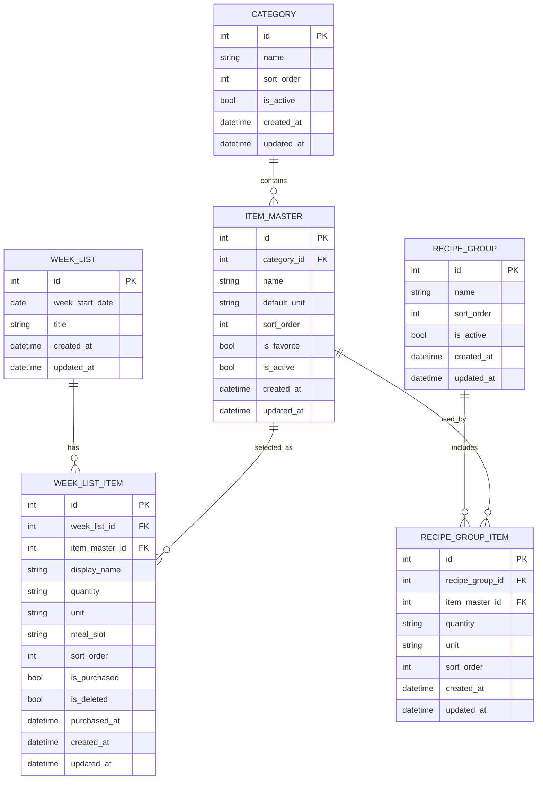

# Weekly Buyerアプリ開発

## 根幹

- １週間分の買い物リストを容易に作成できるようにしたい。
- 買い物中も容易に購入リストに済みのチェックを付けられるようにしたい。

## 憲法案

### 0. 前提
- GitHub Spec Kitは、日本語の利用を前提とすること。

### 1. 買い物中の操作は最短で完了できること

- 買い物リストの確認と購入済みチェックは、片手で素早く完了できることを最優先にする。
- 商品の完了、削除、元に戻すは、画面遷移を増やさず1操作で実行できることを重視する。
- 買い物中に必要な情報は、今見ている一覧画面に集約する。

### 2. １週間単位で迷わず確認できること

- リストは１週間分をひとまとまりとして扱う。
- 画面上では、週全体の見通しとカテゴリ順の把握を優先する。
- 日ごとの情報は、必要な場合だけ補助的に扱う。

### 3. 商品データは再利用しやすく保つこと

- 商品名は毎回入力し直すのではなく、商品マスタとして再利用できるようにする。
- よく買う定番品は、候補としてすぐ選べるようにする。
- 音声入力や自動入力で新しい商品が出た場合は、候補として蓄積していく。

### 4. 料理由来のまとめ登録を支えること

- 料理名から複数の商品をまとめて追加できることを重視する。
- 料理グループと商品グループは、あとから再利用できる形で保持する。
- 料理起点の入力と、商品起点の手動入力の両方を許容する。

### 5. カテゴリ順と並び順はユーザーが制御できること

- 商品カテゴリの並び順は固定せず、利用者が変更できるようにする。
- カテゴリ配下の商品も追加・変更・削除できるようにする。
- 買い物時の一覧は、カテゴリ順で安定して見えることを優先する。

### 6. ローカル保存を基本にして軽く動くこと

- まずは端末内保存を基本にして、オフラインでも使えることを優先する。
- 保存はローカルDBを前提にし、起動直後にすぐ使えることを重視する。
- 将来の同期や共有は拡張として扱い、初期段階では複雑化させない。

### 7. 状態遷移は予測可能であること

- 購入済み、未購入、削除、元に戻すの状態は、画面上で分かりやすく一貫して扱う。
- フリック、チェック、元に戻すの操作は、意図しないデータ消失を起こさないようにする。
- 何が保存され、何が一時的な表示かを明確に分ける。

### 8. 実装はシンプルに拡張可能であること

- 画面、状態管理、保存層を分けて保守しやすくする。
- 音声入力、ウィジェット、共有同期は後から足しやすい構造にする。
- 最初の実装では、買い物リストの基本動作を壊さないことを優先する。

### 9. 非目標

- 最初からクラウド同期を必須にしない。
- 最初から複雑な献立管理を前提にしない。
- 最初から多機能な在庫管理アプリにはしない。

## ユーザーストーリー

### 買い物リストを作りたい

- 買い物をする人として、１週間分の買い物リストを作りたい。
- 買い物をする人として、商品を追加してリストを増やしたい。
- 買い物をする人として、よく買う定番品をすぐに追加したい。
- 買い物をする人として、音声入力で素早く商品を追加したい。

### 料理からまとめて登録したい

- 買い物をする人として、料理名から関連する複数の商品をまとめて追加したい。
- 買い物をする人として、商品名の候補から選んで、料理グループにひも付けたい。
- 買い物をする人として、料理グループに登録した商品を次回以降も再利用したい。

### 買い物中に素早く完了したい

- 買い物をする人として、済んだ商品にチェックを付けたい。
- 買い物をする人として、左フリックで商品を購入済みにしたい。
- 買い物をする人として、購入済みの商品を一覧から非表示にしたい。
- 買い物をする人として、画面下部で１件削除と元に戻すをすぐ使いたい。
- 買い物をする人として、元に戻す操作で購入済みにした商品をリストへ戻したい。

### 管理しやすくしたい

- 買い物をする人として、商品をカテゴリ順に並べて見たい。
- 買い物をする人として、１週間分の全商品をまとめて確認したい。
- 買い物をする人として、カテゴリの並び順を変更したい。
- 買い物をする人として、商品カテゴリを追加・変更・削除したい。

## 機能要約

- １週間分のリストを作る。
- 商品名を追加する。
- 料理名から選択した複数の商品名をグループ化する。
- 済んだものにチェックを付ける。
- 購入時リストでは、左フリックで購入済みにし、画面下部に１件削除と元に戻すを表示する。

**画面構成**
- １週間分入力画面
- 購入リスト画面
- 設定画面
  - 商品カテゴリの並び順を変更できる
  - 商品カテゴリの商品追加、変更、削除

**差別化しやすい要素**
- 音声入力で素早く追加
- 「牛乳」「卵」みたいな定番品をワンタップ追加
- 買い物先ごとのカテゴリ分け

**技術の組み方**
- Dart + Flutter の Material 3 構成
- 保存は、Flutter のDrift
- 状態管理は、Riverpod
- ウィジェット対応は後回しでも可

**最初の実装順**
1. ローカル保存の買い物リスト
2. チェック・削除・並べ替え
3. 音声入力
4. 料理名グループ（料理名を選択すると商品リストに複数商品追加・リストから選択した商品を料理名からグルーピングできる）

### １週間部のリストを作る

曜日ごとに商品を追加して、同時に1週間の献立も考えるなら、画面は「週全体の見通し」と「その日の入力」を同時に扱える構成が一番使いやすいです。おすすめは、メインを 1 画面に集約した「週間ボード型」です。

**おすすめの画面構成**
- 上部に「今週の曜日タブ」
  - 月〜日を横スクロールか7分割で表示
  - 今日の曜日だけ強調
  - その日を切り替えると、献立と商品がその日に紐づいて表示される
- 上部から下に「商品リスト」
  - その曜日に追加した商品を一覧表示
  - チェック済み、未購入、数量不足を分ける
- 画面下に固定の「追加ボタン」
  - 商品追加（商品名と数量を自由入力、または、音声入力）
  - 料理名から追加（料理名をモーダルにてリスト表示から選択）
  - 前日をコピー
  - よく使う食材から追加

**特に便利な機能**
- コピー操作
  - 先週の火曜を今週の火曜に複製
  - 月曜の献立を水曜に流用
- スワイプ操作
  - 左右スワイプで曜日移動
  - 商品の完了、削除、移動を素早く操作

**UIの結論**
- いちばん実用的なのは「週間タブ + その日の献立 + その日の商品リスト + ボトムシート追加」
- これだと、献立を考えながら商品を追加する流れが切れません
- 入力よりも「候補選択」と「コピー」を中心にすると、かなり速く使えます

### 商品追加画面

Flutter の Material 3 で組みやすいように、1画面を「上部の曜日切替」「朝昼夜のセクション」「下部の追加操作」に分解した形で整理します。見た目よりも実装単位が追いやすい版にします。Flutter 向けなら、強いカード装飾よりも、`ListView` と各セクションの Widget に分けやすい形がよいです。ASCII だとこんな崩し方が実装しやすいです。

```text
┌────────────────────────────────────┐
│  4/18 Sat                     週間 │
│  [月] [火] [水] [木] [金] [土] [日] │
└────────────────────────────────────┘
┌────────────────────────────────────┐
│ 朝  3件                       [＋]  │
│ ──────────────────────────────────  │
│ □ 牛乳                     1本     │
│ □ 食パン                   1袋     │
│ □ 卵                     1パック   │
└────────────────────────────────────┘
┌────────────────────────────────────┐
│ 昼  2件                       [＋]  │
│ ──────────────────────────────────  │
│ □ 弁当                     1個     │
│ □ お茶                     1本     │
└────────────────────────────────────┘
┌────────────────────────────────────┐
│ 夜  5件                       [＋]  │
│ ──────────────────────────────────  │
│ □ 豚肉                    300g     │
│ □ キャベツ                1/2玉    │
│ □ みそ                     1個     │
│ □ 豆腐                     1丁     │
│ □ ねぎ                     1本     │
└────────────────────────────────────┘

                [ 追加 ]
```

Flutter での分解イメージはこうです。

- `DailyScreen`
  - `WeekHeader`
  - `MealSectionList`
  - `FloatingActionButton`
- `WeekHeader`
  - 日付表示
  - 曜日チップ
- `MealSection`
  - 朝 / 昼 / 夜 の見出し
  - 件数
  - 追加ボタン
  - 商品の縦リスト
- `ItemRow`
  - チェックボックス
  - 商品名
  - 数量

実装しやすさを優先するなら、朝昼夜は最初から重いカードにせず、`Divider` を使った単純な区切りで分けるのが扱いやすいです。各セクションの「＋」を押したときだけ `showModalBottomSheet` を出して、朝・昼・夜と商品名を入力させると流れが自然です。

Flutter の状態管理も相性がよくて、例えばこういう状態で持てます。

- 選択中の曜日
- 朝のリスト
- 昼のリスト
- 夜のリスト
- 追加先のセクション
- 追加用 BottomSheet の表示状態

### 購入リスト画面

買い物時に商品の購入漏れを確認する画面。すてべリストがなくなったら、すべての商品が購入完了。

┌────────────────────────────────────────┐
│     │
│  カテゴリ順で表示（19/20）              │
│  [ すべて ] [ 野菜 ] [ 肉 ] [ 魚 ] ... │
├────────────────────────────────────────┤
│  [野菜]                                │
│  ────────────────────────────────────  │
│  ←  キャベツ              1/2玉       │
│  ←  たまねぎ              2個         │
│  ←  じゃがいも            3個         │
│  ←  ほうれん草            1束         │
│                                        │
│  [肉]                                  │
│  ────────────────────────────────────  │
│  ←  豚肉                  300g        │
│  ←  鶏むね肉              2枚         │
│  ←  ひき肉                1パック     │
│                                        │
│  [魚]                                  │
│  ────────────────────────────────────  │
│  ←  さば                 2切れ        │
│  ←  しらす                1袋         │
│                                        │
│  [乳製品・卵]                          │
│  ────────────────────────────────────  │
│  ←  牛乳                  2本         │
│  ←  卵                    2パック     │
│  ←  チーズ                1個         │
│                                        │
│  [調味料]                              │
│  ────────────────────────────────────  │
│  ←  みそ                  1個         │
│  ←  しょうゆ              1本         │
│  ←  砂糖                  1袋         │
├────────────────────────────────────────┤
│  左フリックで購入済み → 一覧から非表示   │
│  [ 1件削除 ]           [ 元に戻す ]     │
└────────────────────────────────────────┘

この形だと、以下の意図になります。

- 画面上部には、何分の何の購入進捗状況を表示する。
- 1週間分の全商品を1画面で見る
- 日ごとの区切りは出さない
- カテゴリ順で並べる
- 左フリックで購入済みにして一覧から消す
- 画面下部に Gmail 風の削除と元に戻すを出す
- 元に戻すで、購入済みにした商品を元のリストへ戻す

### ER図案

Flutter + Drift で持ちやすいように、まずは「カテゴリ」「商品マスタ」「週間リスト」「週間リスト明細」「料理グループ」を中心にした構成にする。

商品自動入力時は、まず `ITEM_MASTER` を検索し、候補が見つからない場合はその場で新規登録を促す。登録確定後に `ITEM_MASTER` を作成し、そのまま `WEEK_LIST_ITEM` に紐づける。以後はその商品を次回以降の候補として再利用する。



この ER の意図は次の通り。

- `CATEGORY` は商品カテゴリの並び順を管理する
- `ITEM_MASTER` は「牛乳」「卵」などの定番商品や候補一覧を管理する
- `ITEM_MASTER` に存在しない商品は、自動入力の流れの中で新規登録してから使う
- 新規登録された商品は次回から候補に表示される
- `WEEK_LIST` は1週間単位の買い物リストのヘッダとして扱う
- `WEEK_LIST_ITEM` は実際の買い物対象で、購入済み・削除済み・表示順を持つ
- `RECIPE_GROUP` と `RECIPE_GROUP_ITEM` は、料理名から複数商品をまとめて追加するためのひも付けを持つ

`meal_slot` は朝・昼・夜の区分を残す場合に使えるが、将来不要になれば空運用か削除してもよい。

購入済みを左フリックで一覧から消して、元に戻す操作は、基本的には `WEEK_LIST_ITEM.is_purchased` と `is_deleted` の状態で表現する。画面下部の Gmail 風バーは UI の undo であり、必須の履歴テーブルではない。
