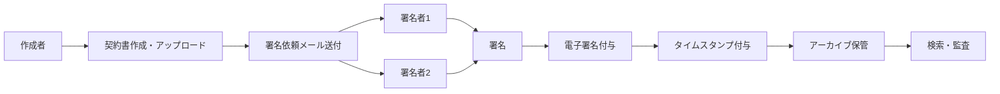

# エグゼクティブサマリー  
電子署名・署名データ保管サービスは、法改正やテレワーク普及を背景に利用が急増しており、金融・保険、不動産、医療、教育、人事・労務、法務・B2B契約、行政手続、サプライチェーン、IoT/製造、SaaS連携など多彩な業界・業務での活用が期待されます【8†L115-L122】【33†L21-L26】。たとえば、金融機関ではローン契約・口座開設等で、保険業では保険証券・社内稟議で、宅建業界では賃貸・売買契約書で、医療業界では同意書・電子カルテで電子署名が活用され始めています【8†L115-L122】【17†L75-L79】。しかし、本人確認や法規制（電子署名法、労働法、医療法、個人情報保護法など）、既存ワークフロー連携、UX、保管要件（長期保存・監査ログ）などの障壁があるため、それぞれに対応した機能・運用と啓蒙が必要です【35†L87-L90】【27†L42-L49】。収益化モデルとしては、サブスクリプションと従量課金の組み合わせ、付加価値サービス（ワークフロー連携、CLM、時刻証明、翻訳など）、パートナー販売（SIer連携、業界特化サービス）が考えられ、KPIは導入企業数、取引件数、保管件数、ARRなどです【47†L110-L117】【57†L29-L38】。導入優先度として、短期的には法改正対応・金融・行政分野、基盤機能強化を、中期的には保険・不動産・医療分野と他SaaS連携を、長期的にはIoT/製造分野や海外展開、AI活用などを検討します。実装ロードマップでは認証方式（メール認証、マイナンバー署名、外部CA連携など）の拡充、API・他システム連携、監査ログ・保存検索機能の強化、SLA策定など段階的に進めます。以下に詳細を示します。

**短期アクション（〜1年）例:**  
- 金融・行政分野向けのサービス強化と営業展開（e.g. 地方自治法改正対応【40†L1-L4】、メガバンクでの導入事例活用【15†L57-L64】）  
- 基本機能整備（多要素認証、メール認証、署名リマインダー、契約テンプレート、検索機能、監査ログ）および主要API連携（Salesforce、ERP、クラウドストレージなど）  
- パートナー獲得（SIer、業界団体、SaaSベンダーとの協業）による顧客層拡大  

**中期アクション（1〜2年）例:**  
- 保険、不動産、医療、教育、人事分野への展開（各業界向け機能/UI整備、用語テンプレート対応、電子帳簿保存法・医療法規制への対応支援【20†L100-L103】【54†L128-L132】）  
- 高度認証（マイナンバー署名、外部認証局連携）や多言語対応、スマホ認証、電子証明書機能などの拡充【35†L87-L90】【52†L111-L119】  
- 付加価値サービス提供（契約ライフサイクル管理、文書翻訳・要約、AIによる契約内容解析、組織内ワークフロー連携）  

**長期アクション（2〜5年）例:**  
- IoT/製造業向けコード署名・サプライチェーン活用（ファームウェア署名、サプライヤーNDA管理【57†L13-L22】）およびグローバル対応（eIDASなど海外規格対応）  
- AI・データ分析活用の高度化（署名ログ分析、契約リスク予測、自動起票）  
- クラウドサービスの信頼性向上（ISO/IEC認証取得、99.9%可用性SLA策定、ブロックチェーン等によるタイムスタンプ）  

下記で各項目を詳細に分析し、参照元を示します。

## 1. 現状と前提  
現状、**電子署名+署名データ保管サービス**を提供中とし、詳細仕様は未公開のため「既に署名機能＋クラウド保管機能を有し、API連携可能なSaaS」と仮定します。日本では電子署名法（2000年施行）により、特定の条件を満たした電子署名は紙署名と同等の法的効力が認められています【35†L87-L90】。署名時に署名者の本人性が示され（マイナンバー認証や外部CAの認証など）かつ文書改ざんが防止されていれば、電子契約として成立します【35†L87-L90】【57†L21-L29】。また電子帳簿保存法や医療法施行規則では、法定保存文書の電子保管に対して電子署名＋タイムスタンプの付与が求められ、長期署名（長期保存に耐える仕組み）の利用が推奨されています【33†L67-L70】【20†L118-L123】。こうした法規制を踏まえ、*既存サービスでは署名時に利用者認証*（メール・SMS認証、マイナンバー署名など）*や証明書発行*、*監査ログ・タイムスタンプ機能*を備えていることが想定されます【35†L87-L90】【33†L67-L70】。

## 2. 業界別有望利用シーンとユースケース  
多様な業界で導入が見込まれます。代表的な分野と具体的活用例を示します。

- **金融業（銀行・証券）:** 口座開設書類、ローン契約書、保証契約、NDA、内部稟議書などの署名。メガバンクやネット銀行で既に電子契約導入事例が多数あります（例：イオン銀行の融資契約、三井住友信託銀行グループでの社内稟議・対外契約に適用【15†L57-L64】【58†L288-L290】）。電子署名で手続き時間短縮・押印不要・郵送コスト削減が可能です【58†L288-L290】。

- **保険業:** 保険証券や補償契約書、保険代理店との契約、審査書類、請求・支払承認といった書類。生命保険会社では従来の押印ワークフローを電子化し、出社不要・収入印紙不要で業務効率化を達成しています【17†L75-L79】。導入例：明治安田生命では社内契約と議事録の電子化により出社を削減、印紙代コストダウンを実現【17†L75-L79】。

- **不動産業:** 売買契約書、賃貸借契約書、重要事項説明書、地権者同意書など。2022年5月に**デジタル改革関連法**の施行により宅建業法等で書面・押印義務が廃止され、不動産契約の電子化が全面解禁されました【8†L115-L122】。これを受け、タマホームでは工事請負契約を電子化し、年8000～9000件の印紙費約10億円を削減【18†L371-L374】。その他、不動産管理業者でも契約書のオンライン管理・検索性向上による効率化効果が報告されています【18†L392-L396】。

- **医療・介護:** 患者同意書、紹介状、診療報酬請求関連帳票（レセプト）、研究データ記録など。厚労省ガイドラインにより、医療情報保存時は電子署名＋タイムスタンプの活用が推奨されています【20†L100-L103】【20†L118-L123】。電子同意書は本人確認と長期保存が特に重視される分野で、電子署名で「いつ・誰が・何を作成したか」を証明します【20†L108-L113】【20†L118-L123】。導入例として、医療機器開発企業M-INTや慶應義塾大学病院では、電子署名付き長期署名データで医療法・保険医療機関規則に対応した安価な電子保存が実現しています【22†L175-L178】【22†L179-L184】。

- **教育分野:** 入学願書、誓約書、個人情報同意書、授業料契約、奨学金申請書、成績証明書・卒業証明書の発行など。グローバルでは電子署名導入例がありますが、日本の大学等では依然として「誓約書・保証書は自筆押印が必須」とするケースがあります【27†L42-L49】。これらは現状の法令・校則では電子署名未対応ですが、入学事務・保護者同意手続きのDXニーズは高く、早稲田大でも電子署名対応を求める声があります【27†L42-L49】。将来的には法改正・自治体指針の見直しで教育分野の電子化が進む可能性があります。

- **人事・労務:** 雇用契約書、労働条件通知書、就業規則同意書、労使協定、各種承認書類など。2019年4月から労働条件通知書の電子交付が条件付きで可能となり、2024年4月改正で電子交付要件が緩和されました【54†L128-L132】。電子署名利用により、全国の新入社員への書面送付コスト削減やテレワーク下での雇用契約締結が期待されます。

- **法務・B2B契約:** 取引基本契約、業務委託契約、秘密保持契約、NDA、議事録、社内規程など、対企業・対個人を問わず多様な契約。法律事務所でも電子署名サービスを利用し契約処理を効率化しています。たとえば、ニューズピックスは営業提携契約・発注書などでDocuSign for Salesforceを活用して契約業務を自動化しています【58†L293-L300】。またSansan社やSmartHR社でも営業ワークフローと連携して締結時間を短縮し、デジタル営業を推進しています【58†L304-L312】。

- **行政手続き:** 申請書、許認可書類、地方自治体との契約書、公文書・通知文書の電子化。2021年1月の地方自治法施行規則改正で自治体契約の電子署名要件が緩和され、9月のデジタル改革関連法で押印・対面要件の廃止が広がりました【40†L1-L4】。これにより、従来は紙と押印必須だった行政文書が電子化可能になっています。自治体や官公庁でも電子契約システムの導入が増加しており、東芝デジタルソリューションズではブロックチェーン付きの電子契約システムで行政契約DXを支援しています【40†L1-L4】。

- **サプライチェーン:** 購買発注書、仕入契約、NDA、品質証明書、検品票など。特に製造業ではグローバルサプライチェーンにおいて機密保持契約（NDA）が欠かせません【57†L13-L22】。従来の紙プロセスでは締結に数週間かかるケースもありますが、DocuSignなど主要プラットフォームはERP（SAP/Oracle）やCRM（Salesforce）と連携し、購買業務フロー内でNDA締結を完結可能にします【57†L27-L34】。DocuSignは多言語・モバイル対応で時間差問題を克服し、完成証明書発行による監査対応もサポートします【57†L29-L38】。アジア太平洋地域ではeSignGlobalなど、政府発行IDと統合したソリューションが登場し、各国の電子署名規制にも対応しています【57†L49-L57】。

- **IoT/製造業:** ソフトウェア・ファームウェアの署名、製造記録の電子保存、検査承認プロセスなど。IoT機器のセキュリティ向上には、機器に組み込んだファイルやファームウェアに対する電子署名が有効です。サイバートラストは「SIOTP Client Manager」でIoT機器内で鍵・証明書を安全管理し、機器とデータの真正性を確保する仕組みを提供しています【37†L99-L104】。これにより、製造工程で生成されるデータやソフトを署名し、信頼性の高いマシン生成データを蓄積できます。

- **SaaS連携・他システム:** 電子契約を既存のビジネスツールと連携するシーン。営業支援、CRM、会計、人事システム、ワークフロー、クラウドストレージなどとの統合が重要です。実際、Salesforceやkintoneとの連携例が多く見られ、NTTテクノクロス社はDocuSignとワークフロー連携でパートナー契約１万件/年を電子化し、ミス防止・業務効率化を達成しています【58†L304-L308】。また、Slack/Teams連携やAPI提供によって、チャットから直接契約手続きが始められるようにするニーズも増大しています。電子署名サービスはSaaSエコシステムの中核となり得ます。以下に電子契約の一般的ワークフロー例を示します。

## 3. 導入障壁と解決策  
電子署名導入にあたっては以下の課題が想定され、それぞれ対策が必要です。

- **法規制・認証要件:** 電子署名法で定める「真正性・完全性」「認証業務」条件を満たす必要があります【35†L87-L90】。高度な証明書発行CA（認定認証業者）の利用やマイナンバー連携で本人性を担保する一方、電子帳簿保存法・医療法・労基法など関連法令の要件（保存期間、届出要件）も遵守する必要があります【20†L100-L103】【54†L128-L132】。**解決策:** 必要に応じて公的認証（マイナンバー署名、eID）と自社ID管理を併用し、電子帳簿保存法・医療ガイドライン準拠のタイムスタンプ・長期署名を実装します。教育機関や不動産契約など従来電子化が難しかった分野では、法改正やガイドライン整備を注視しつつ、文書雛形の電子対応化や自治体・大学との協議も行います【8†L115-L122】【27†L42-L49】。

- **本人認証・なりすまし対策:** 電子署名ではメール認証だけでは法的要件を満たしにくく、強固な認証（多要素認証や公的認証）と不正検知が必要です【35†L93-L101】。**解決策:** マルチファクター認証（メール+SMS+認証アプリ）、顔認証・指紋認証付き署名機能、マイナンバーカード認証などを導入し、不正リスクを低減します【35†L89-L97】【35†L99-L103】。大口契約では本人確認書類提出なども併用可能です。

- **ユーザーUX・習熟度:** 利用者側が電子署名ツールに慣れていない、操作が煩雑な場合、導入抵抗が生じます。**解決策:** 簡潔でわかりやすいUI/UX設計、スマホ対応、署名手順案内、導入時研修・サポート体制を整備します。社内稟議やエンドユーザー署名者に対し動画マニュアルや自動リマインダーで不安を軽減する仕組みを用意します。立会人型から順次当事者型へ移行するなど段階導入で受容性を高めます【15†L57-L64】。

- **コスト・ROI:** 初期費用やランニングコスト（API使用料、送信件数課金等）が懸念されます。一方で印紙税や郵送コスト、作業工数削減効果があります【17†L75-L79】。**解決策:** 具体的なコスト削減例（収入印紙・紙代削減【17†L75-L79】）やワークフロー短縮事例を示し、ROIを見せる。また料金プランは契約件数や利用者規模に応じた柔軟設計（従量プラン・定額プラン）とし、小規模ユーザー向け無料枠も検討します。

- **既存システム連携:** 既存の契約管理システムやERP、メール・帳票システム、物理ワークフローとの整合性が課題です。**解決策:** REST APIやWebhook、SAML/OAuthによるシングルサインオン連携、Zapierなど連携プラットフォーム対応を充実させ、システム間データ同期（Salesforce, Kintone, freeeなど）が容易に行えるようにします。郵送依頼・管理帳票など旧来業務は段階的なデジタル置換えガイドラインを用意します。

- **セキュリティ・信頼性:** 保管データに個人情報・機密情報を含むため、クラウドセキュリティ（データ暗号化、アクセス制御、WAF、ログ監視）を担保する必要があります。**解決策:** データは暗号化保管し、TLS通信、多要素認証、認証局ベースの電子証明書で信頼性を確保します。ISO27001/マイナンバー法対応などの外部認証取得も推進します。また、不正アクセスや改ざん検知のため定期監査ログ提供・ブロックチェーン証跡も検討します。

- **保存・監査要件:** 各種法令・契約要件で証憑保管年限が定められます（税法では7年〜10年、医療法では5〜8年）。電子署名付与後も真正性を維持しなければなりません【33†L67-L70】【20†L118-L123】。**解決策:** 長期署名方式（鍵更新・ルート証明書耐久性対応）やタイムスタンプ再付与機能により、証明書有効期限切れ後も署名の有効性を保持します。さらに検索機能や証明書寿命管理で監査要件に対応できるようにします。

## 4. 収益化モデルとKPI  
**課金体系:** 基本はSaaS型サブスクリプション（月額/年額制）＋利用件数従量課金のハイブリッドが望ましく、大量ユーザー向け/大量送信向け割引プランも用意します。例えば、Boxil調査ではクラウドサインがライトプラン¥11,000〜/月（1通¥220〜）、GMOサインが¥8,800〜/月（1通¥100〜）で提供されています【47†L110-L117】。また、長期契約やプロ契約でストレージ容量・保管期間オプション、APIアクセス件数上限拡張など追加課金モデルを加えます。  
**付加価値サービス:** 契約書ひな形ライブラリ（弁護士監修テンプレート）、契約交渉支援チャットボット、CLM連携（契約ライフサイクル管理）、AI要約・翻訳、電子帳簿保存法対応オプション、電子印鑑連携（実印/法人印付与）などを有料オプションとし、基本機能以上の価値提供で収益を上乗せします。例えば、行政や医療機関向けにコンプライアンスコンサルティングを付帯できれば差別化になります。  
**パートナー戦略:** SIer・コンサルティング会社、クラウドERP/CRMベンダー、業界団体との提携でチャネル拡大します。特定業界（金融、医療、不動産など）の協会・ベンダーと共同プランを組成し、専門機能（例：電子カルテ連携、宅建向け雛形セット）の協業開発も検討します。SaaS市場で強いfreee社やマネーフォワード社などとの連携も推進し、会計・労務・請求管理とのクロスセールスを狙います。  
**KPI例:** 新規顧客数・契約企業数、月間発行署名件数、保管中文書件数、ユーザー継続率（リテンション）、アップセル率、NPSなどを設定します。市場規模の目安として、ITトレンド調査で**日本の企業における電子契約システム導入率は2025年に78.3%**に達したと報告されており、市場は飽和から成熟期へ移行しつつあります【59†L1-L4】。シェア拡大には独自機能・価格競争力・サポート品質が鍵となります。

## 5. 優先度と実装ロードマップ  
導入優先度を見据え、**短期（〜1年）**には法改正対応と市場開拓、**中期（1〜2年）**には機能強化と業界拡大、**長期（2年超）**には新技術・新市場への展開を進めます。ロードマップ例：

- **短期（Priority: 高）:**  
  - **法令対応・市場攻勢:** 地方自治法・デジタル改革関連法改正（行政契約）や電子帳簿保存法対応を迅速に実装し、官公庁・金融機関への提案強化【40†L1-L4】【59†L1-L4】。金融機関・保険会社のDX事例を活用した営業活動。  
  - **コア機能実装:** 電子署名（メール・SMS認証、署名者署名欄指定）、タイムスタンプ付与、ワークフロー機能（多段承認、リマインダー）、権限管理、全文検索・監査ログ記録を実装。各種認証局・ICカード認証との連携準備。  
  - **連携強化:** Salesforce/ERP/kintone/API連携、Slack/Teams連携など主要SaaSとのパイプライン作成。既存の社内契約管理システムや電子印鑑クラウド（GMOサイン等）との連携開発に着手。

- **中期（Priority: 中）:**  
  - **業界特化機能:** 医療用電子同意書テンプレート・保存機能、宅建協会向け電子開示機能、教育機関向け保護者同意フロー、人事向け労働条件通知フローなどを開発。要件緩和が進む労務・教育分野への参入準備【54†L128-L132】【27†L42-L49】。  
  - **高度認証・長期保存:** マイナンバーカード署名機能実装【52†L111-L119】、外部CA認証連携（認定認証業者PCA/ISMA等）、電子帳簿保存法に対応した長期署名サービスの提供（鍵更新サポート、SHA家タイムスタンプ）。  
  - **グローバル・多言語対応:** 国際契約向けに英語UI・eIDAS準拠証明書対応、海外拠点との取引対応（タイムゾーン配慮）。グローバル企業向けにDocuSign/Adobe Signとの差別化（APAC専用のeSignGlobalと棲み分け）も検討。

- **長期（Priority: 低→中）:**  
  - **IoT/製造業展開:** ファームウェア署名SDKやデバイスID管理など新サービスで製造分野参入【37†L99-L104】【57†L13-L22】。グローバルサプライチェーンにおけるコンプライアンス機能（NDA管理、産業標準IEC62443対応）。  
  - **AI・高度分析:** 契約書AI要約、リスク分析機能、署名ログ解析による不正検知の高度化。契約クローゼングループとの連携CLM機能の強化【57†L71-L78】。  
  - **運用基盤強化:** ISO/IECセキュリティ認証、99.9%可用性SLA、多拠点DR構成（保存・監査要件対応）。新技術（ブロックチェーンによる真正性保証）やガバナンス機能の検証。  

各段階でマーケティング投資、ユーザーサポート体制、製品ロードマップと連動した機能リリース計画を明確化します。図表例として、サービスの実装・拡張ロードマップを次に示します。

| 項目                    | 短期 (～1年)                       | 中期 (1～2年)                           | 長期 (2年超)                      |
|------------------------|----------------------------------|---------------------------------------|----------------------------------|
| 認証方式                | メール/SMS認証、Basic署名          | マイナ認証、外部CA連携                | 多要素認証強化（生体認証等）       |
| API/連携               | Salesforce/kintone連携、Slack 連携 | ERP連携、クラウドストレージ統合        | IoTプラットフォーム連携            |
| 監査ログ・保存検索      | 署名イベントログ、全文検索実装     | タイムスタンプ長期化対応、保存期限管理 | ブロックチェーン記録検証          |
| SLA/可用性             | 90%以上（冗長化構成検討）          | 99%以上、ISO認証取得                 | 5分以内RTO、99.99% SLA            |

## 6. 競合および代替手段分析  
主要な電子署名サービス・代替ソリューションを比較し、差別化要素を整理します。日本国内では弁護士ドットコム社の「クラウドサイン」やGMOグローバルサイン社の「電子印鑑GMOサイン」が大きなシェアを占めており、累計導入社数はそれぞれ約250万社、350万社を超えます【47†L101-L104】。クラウドサインは弁護士監修の契約テンプレートやワークフロー機能を備え、主に「立会人型署名」を採用しています。一方GMOサインは「立会人型／当事者型」の両方式に対応し、多様なデバイス・チャネルを柔軟に扱えます【47†L110-L117】。価格面ではGMOサインが割安（例：月額¥8,800～、1通¥100～【47†L112-L115】）で大量送信に向いていますが、CloudSignは法務ガバナンス重視の企業に選ばれます【47†L110-L117】。

グローバルでは**DocuSign**（世界170万人超の顧客【60†L1-L4】）と**Adobe Acrobat Sign**が高いシェアを持ちます。DocuSignは1000以上の外部システム連携が可能でエンタープライズ機能が豊富ですが、米EUのESIGN/eIDAS中心でAPACのローカル要件対応は限定的です【57†L64-L68】。これに対し、eSignGlobalやHelloSign（Dropbox Sign）は多言語対応やシンプルUIを売りとし、特にAPAC市場で現地IDや規制に対応した統合アプローチを取ります【57†L49-L57】【57†L64-L68】。  
日本企業では他に、**SMBCクラウドサイン**（SMBCグループ）、**freeeサイン**、**マネーフォワード クラウド契約**、**WAN-Sign**（野村総研系）などが存在します。差別化ポイントとして、認定証明書発行の有無、API連携数、使いやすさ、料金体系、サポート態勢、セキュリティ認証取得（ISO27001等）などが挙げられます。たとえば、WAN-Signは銀行グループ向けに柔軟性を重視して導入されており、ユーザーからも法令対応力や導入実績が選定理由として挙がっています【15†L57-L64】【15†L76-L81】。

## 7. 導入事例・関連法令・参考規格  
本レポートで引用した事例・法令・ガイドラインは以下の通りです：  
- **業界別事例:** イオン銀行（金融）、ワンラップ（銀行グループ）【15†L57-L64】【58†L288-L290】、明治安田生命（保険）【17†L75-L79】、タマホーム・インテリア工事会社（不動産）【18†L371-L374】【18†L392-L396】、M-INT・慶応病院（医療）【22†L175-L178】【22†L179-L184】、早稲田大学日本語研センター（教育；電子署名不可例）【27†L42-L49】、NTTテクノクロス・SmartHR（SaaS連携）【58†L304-L312】、eSignGlobalブログの製造業サプライチェーンNDA事例【57†L13-L22】【57†L27-L34】など。  
- **規格・ガイドライン:** 日本「電子署名及び認証業務に関する法律」、改正「電子帳簿保存法」、個人情報保護法、マイナンバー法、**地方自治法施行規則改正**【40†L1-L4】、厚労省「医療情報システムの安全管理に関するガイドライン」【20†L100-L103】、労働基準法施行規則（労働条件通知書の電子化要件）【54†L128-L132】など。海外規格ではIEC62443（製造システム）やeIDAS（EU電子認証）、ISO27001/ISO9001などの導入がセキュリティ・品質保証として参考になります。  
- **その他参考:** JIPDECの電子署名活用解説【33†L21-L26】【33†L67-L70】やITトレンドの市場動向【59†L1-L4】、クラウドサイン/マネーフォワードの技術コラム【35†L87-L90】【54†L128-L132】も参考になります。

以上を踏まえ、電子署名・署名データ保管サービスは各業界で多くのユースケースが期待される成長領域です。規制・技術・顧客ニーズを総合的に分析し、実装ロードマップと収益モデルを精緻化することで、着実にユーザーを拡大できます。

